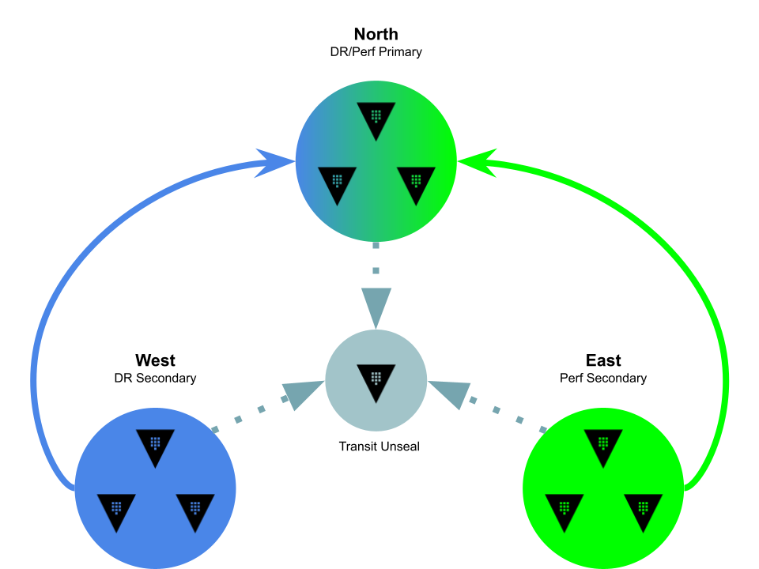

# Overview

This demo creates four Vault enterprise clusters and establishes DR and Performance replication relationships between them to provide a self-contained sandbox environment for experimenting with [HashiCorp Vault Enterprise](https://developer.hashicorp.com/vault/docs/enterprise/replication) replication [APIs](https://developer.hashicorp.com/vault/api-docs/system/replication).

# Disclaimer

This project is for demonstration/learning purposes only.  These scripts are fragile and have only been tested against a local `minikube` environment.

# Architecture

**Unseal cluster**

* One-node dev cluster used for Transit auto-unseal

**North cluster**

* Three-node Raft cluster used for DR/Perf Primary

**West cluster**

* Three-node Raft cluster used for DR Secondary

**East cluster**

* Three-node Raft cluster used for Performance Secondary

# Usage

## Dependencies

* `jq`
* `kubectl` configured to connect to a Kubernetes cluster
* `helm` configured with [HashiCorp's official repo](https://developer.hashicorp.com/vault/docs/platform/k8s/helm/run#how-to)
* A valid Vault Enterprise license stored as a generic Secret `vault-license`, with a key-name `vault.hclic`

## Workflow

`./setup.sh`

This file initializes the deployments and configures the replication
relationships.  It will check for dependencies and a HashiCorp Vault Enterprise
license before performing the following:

1. Deploy unseal cluster
1. Configure Transform secrets engine for Transit Auto-Unseal
1. Deploy and initialize north, east, and west clusters, writing initial recovery keys and root tokens to `./keys` directory
1. Enable DR/Perf primary on north cluster
1. Enable DR secondary on west cluster
1. Enable Perf secondary on east cluster

`. ./prepare-env.sh`

This file provides a series of bash functions and aliases to interact directly
with the clusters and pods:

* `north` -- Submits `vault` CLI sub-commands to the `north-vault` service endpoint
* `north-active` -- Submits `vault` CLI sub-commands to the `north-vault-active` service endpoint (aliased to `na`)
* `north-standby` -- Submits `vault` CLI sub-commands to the `north-vault-standby` service endpoint (aliased to `ns`)
* `north-sh [0-2]` -- Starts an interactive `sh` session inside of `north-vault-0` (default) or the pod index specified in the first argument
* `north[0-2]` -- Submits `vault` CLI sub-commands to the `north-vault-n` pod via `kubectl exec`, where `n` is the pod index between `0` and `2` (aliased to `n[0-2]`)

Replace `north` with `east` or `west` to interact with those specific clusters.

`./cleanup.sh`

Attempts to sanely teardown this demo environment by uninstalling the Helm charts, removing persistent volumes the Helm chart leaves behind, and unsetting shell functions or aliases.

## TODO

* `generate-dr-token.sh`
* `generate-root-token.sh`
* `failover.sh`
* `split-head.sh`
* `status.sh`
