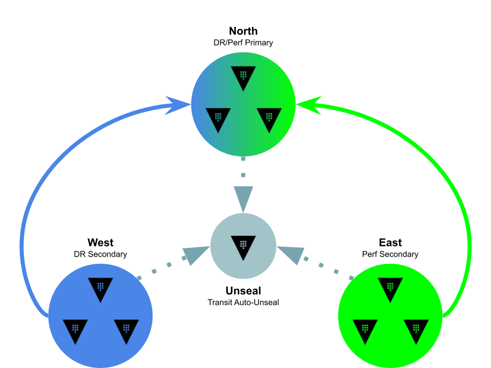

# Overview

This demo creates four Vault enterprise clusters and establishes DR and Performance replication relationships between them to provide a self-contained sandbox environment for experimenting with [HashiCorp Vault Enterprise](https://developer.hashicorp.com/vault/docs/enterprise/replication) replication [APIs](https://developer.hashicorp.com/vault/api-docs/system/replication).

# Disclaimer

This project is for demonstration/learning purposes only.  These scripts are fragile and have only been tested against a local `minikube` environment.

# Architecture



**Unseal cluster**

* One-node dev cluster used for Transit auto-unseal

**North cluster**

* Three-node Raft cluster used for DR/Perf Primary

**West cluster**

* Three-node Raft cluster used for DR Secondary

**East cluster**

* Three-node Raft cluster used for Performance Secondary

# Usage

## Dependencies

* `bash` v4.0 or newer
  * If you're using MacOS, you can install a newer version of `bash` from Homebrew:

    ```
    $ brew install bash
    ```

* `jq`
* `kubectl` configured to connect to a Kubernetes cluster
* `helm` configured with [HashiCorp's official repo](https://developer.hashicorp.com/vault/docs/platform/k8s/helm/run#how-to)
* A valid Vault Enterprise license stored as a generic Secret `vault-license`, with a key-name `vault.hclic`

## Workflow

`./setup.sh`

This file initializes the deployments and configures the replication relationships.  It will check for dependencies a HashiCorp Vault Enterprise license before performing the following:

1. Deploy unseal cluster
1. Configure Transform secrets engine for Transit Auto-Unseal
1. Deploy and initialize north, east, and west clusters, writing initial recovery keys and root tokens to `./keys` directory
1. Enable DR/Perf primary on north cluster
1. Enable DR secondary on west cluster
1. Enable Perf secondary on east cluster

Note that you can specify either the container image or version by setting the following environment variables:

* `VAULT_IMAGE` -- Defaults to `hashicorp/vault-enterprise`
* `VAULT_VERSION_TAG` -- Defaults to `latest`.  _Note: Make sure to select a valid tag from [HashiCorp's Docker Hub repository](https://hub.docker.com/r/hashicorp/vault-enterprise/tags); some earlier versions use underscores (`_`) rather than hyphens (`-`)_

`. ./prepare-env.sh`

This file provides a series of bash functions and aliases to interact directly with the clusters and pods:

* `north` -- Submits `vault` CLI sub-commands to the `north-vault` service endpoint
* `north-active` -- Submits `vault` CLI sub-commands to the `north-vault-active` service endpoint (aliased to `na`)
* `north-standby` -- Submits `vault` CLI sub-commands to the `north-vault-standby` service endpoint (aliased to `ns`)
* `north-sh [0-2]` -- Starts an interactive `sh` session inside of `north-vault-0` (default) or the pod index specified in the first argument
* `north[0-2]` -- Submits `vault` CLI sub-commands to the `north-vault-n` pod via `kubectl exec`, where `n` is the pod index between `0` and `2` (aliased to `n[0-2]`)

Replace `north` with `east` or `west` to interact with those specific clusters.  For example, to check the `vault status` on the active node in the North cluster:

```
$ north-active status
Key                      Value
---                      -----
Recovery Seal Type       shamir
Initialized              true
Sealed                   false
Total Recovery Shares    1
Threshold                1
Version                  1.12.0+ent
Build Date               2022-10-10T19:00:46Z
Storage Type             raft
Cluster Name             vault-cluster-7c1a39ff
Cluster ID               ff6d75e2-f626-40e7-6b80-f5cbd813401c
HA Enabled               true
HA Cluster               https://north-vault-0.north-vault-internal:8201
HA Mode                  active
Active Since             2022-10-17T23:46:47.442173754Z
Raft Committed Index     364
Raft Applied Index       364
Last WAL                 62
```

To see the Vault binary version in the `east-vault-0` pod:

```
$ e0 version
Vault v1.12.0+ent (2b95ea0ba6fe708949201df0f84bc30b5b1bf74a), built 2022-10-10T19:00:46Z
```

To see the list of Raft peers in the West cluster:

```
$ west-active operator raft list-peers -dr-token=hvs.8DEK1exgxIuT9HBWGTwIY9kG
Node                                    Address                                  State       Voter
----                                    -------                                  -----       -----
542aff89-0d79-8918-331b-3d2f497cde19    west-vault-0.west-vault-internal:8201    leader      true
d7eba1b3-343b-83c7-d9ca-e2bf46e6acc3    west-vault-2.west-vault-internal:8201    follower    true
35f69c69-51f7-8fbd-2190-aaa85fb0cf8b    west-vault-1.west-vault-internal:8201    follower    true
```


`./status.sh`

Prints the cluster and replication status (in a pretty pretty table).

`./generate-dr-token.sh`

Iterates over clusters and generates a DR token on any DR secondary clusters found.

`./generate-dr-token.sh [north east west]`

Iterates over clusters and generates a root token on any non-DR secondary clusters found, or attempt to create a root token on optionally specified cluster.

`./login.sh`

Iterates over cluster and attempts a `vault login` to write a `~/.vault-token` inside each container.  Will automatically generate a new root token on Performance Secondary clusters and skip DR Secondary clusters.

`./cleanup.sh`

Attempts to sanely teardown this demo environment by uninstalling the Helm charts, removing persistent volumes the Helm chart leaves behind, and unsetting shell functions or aliases.

## TODO

* ~Add Examples section~
* ~Parameterize Vault image version~
* Create each cluster in its own namespace
* `failover.sh`
  * Ensure helper text explicitly describes scenario, following SOP
* `split-head.sh`
  * Ensure helper text explicitly describes scenario, following SOP and describes What Went Wrong™
* Add optional parameter to `setup.sh` to specify `primary_cluster_addr` options aimed at service endpoints
* Enable TLS by default issued from PKI engine on Unseal cluster
* Add `south` cluster to initially act as PR secondary's DR secondary
* Enable k8s auth
  * chaosmonkey mitm TLS?
* Introduce the Agent Injector into this madness
* Add chaosmonkey script to arbitrarily block pod ports
* Something something Rancher?
* Something something OpenShift?
* Allow for Consul/Other(Postgres) storage backend?
* Create/borrow synethtic load script (primarily thinking of Brian Shumate's exceptional [Blazing Sword](https://github.com/brianshumate/vaultron/blob/main/blazing_sword))
* Implement/add Vault/Helm TF providers in place of my One True Love Bash <3
* Maybe one day make robust enough to deploy Vaults across multiple k8s clusters?
  * chaosmonkey mitm k8s auth injector?
